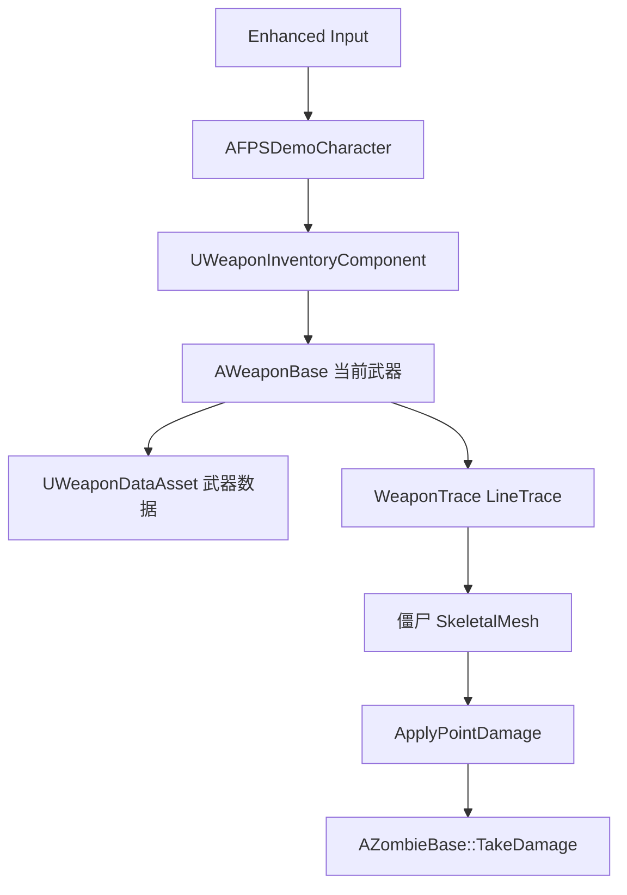

# 武器系统说明

本文档说明当前 C++ 枪械武器系统的整体架构、核心类职责、主要流程和蓝图接入方式，用于快速理解和继续扩展。

## 1. 总览

当前武器系统在原有投射物武器之外新增了一套基于 LineTrace 的枪械逻辑。玩家通过 `AFPSDemoCharacter` 接收 Enhanced Input 输入，输入转发到 `UWeaponInventoryComponent`，库存组件再调用当前装备的 `AWeaponBase` 执行开火、换弹或切枪。

核心特点：

- 开火检测使用 `LineTraceSingleByChannel`。
- 射线起点优先使用第一人称相机位置，方向使用相机前向。
- 伤害在武器类中计算，爆头由命中骨骼名判断。
- 使用 `UGameplayStatics::ApplyPointDamage` 传递最终伤害和完整 `HitResult`。
- 武器数据通过 `UWeaponDataAsset` 配置，方便不同枪械复用同一套 C++ 行为。
- 库存组件支持主武器、副武器、特殊武器三个槽位，以及按弹药类型共享备弹。

## 2. 目录结构

主要源码位于：

```text
Source/FPSDemo/Public/Weapon
Source/FPSDemo/Private/Weapon
```

相关文件：

```text
Public/Weapon/WeaponTypes.h
Public/Weapon/Data/WeaponDataAsset.h
Private/Weapon/Data/WeaponDataAsset.cpp
Public/Weapon/Weapons/WeaponBase.h
Private/Weapon/Weapons/WeaponBase.cpp
Public/Weapon/Components/WeaponInventoryComponent.h
Private/Weapon/Components/WeaponInventoryComponent.cpp
Public/Weapon/Pickups/WeaponPickup.h
Private/Weapon/Pickups/WeaponPickup.cpp
Private/Tests/WeaponSystemTests.cpp
```

接入角色和僵尸的文件：

```text
Public/Character/FPSDemoCharacter.h
Private/Character/FPSDemoCharacter.cpp
Public/Character/FPSDemoPlayerController.h
Private/Character/FPSDemoPlayerController.cpp
Private/Character/Zombies/ZombieBase.cpp
Config/DefaultEngine.ini
```

## 3. 架构关系



职责分层：

- `AFPSDemoCharacter`：负责输入绑定和把玩家操作转发给武器库存。
- `AFPSDemoPlayerController`：负责加入默认输入映射和武器输入映射。
- `UWeaponInventoryComponent`：负责持有武器、切枪、备弹、换弹和对当前武器发命令。
- `AWeaponBase`：负责单把枪的开火、射线检测、爆头判定、伤害计算、开火音效和蓝图事件。
- `UWeaponDataAsset`：负责保存枪械配置数据。
- `AWeaponPickup`：负责世界拾取物触发、生成武器实例并交给库存。
- `AZombieBase`：负责让枪械射线命中骨骼网格体，并在受伤时扣血。

## 4. 核心类型

### 4.1 `EWeaponSlot`

定义武器槽位：

- `None`：无槽位。
- `Primary`：主武器。
- `Secondary`：副武器。
- `Special`：特殊武器。

库存组件按槽位保存武器。同一槽位只能存在一把武器，新武器加入同槽位时会替换旧武器。

### 4.2 `EWeaponAmmoType`

定义弹药类型：

- `None`
- `Rifle`
- `Pistol`
- `Shell`

备弹不是按单把武器保存，而是按弹药类型共享。例如两把使用 `Rifle` 的武器会使用同一个步枪弹药池。

### 4.3 `EWeaponFireMode`

定义开火模式：

- `SemiAuto`：半自动，按下一次只开一枪。
- `FullAuto`：全自动，按下后先立即开火，再用定时器按 `FireInterval` 持续开火。

### 4.4 `FPSDemoWeapon::WeaponTraceChannel`

`WeaponTypes.h` 中把枪械射线通道封装为：

```cpp
FPSDemoWeapon::WeaponTraceChannel
```

它对应 `DefaultEngine.ini` 中的 `ECC_GameTraceChannel2`，名称为 `WeaponTrace`。这样代码里不用散落硬编码的通道编号。

## 5. `UWeaponDataAsset`

文件：

```text
Public/Weapon/Data/WeaponDataAsset.h
Private/Weapon/Data/WeaponDataAsset.cpp
```

作用：保存一把枪的全部可配置参数。C++ 只实现通用行为，具体步枪、手枪、霰弹枪等差异由数据资产控制。

主要字段：

- `WeaponId`：武器标识。
- `Slot`：武器槽位。
- `AmmoType`：使用的弹药类型。
- `FireMode`：半自动或全自动。
- `MagazineCapacity`：弹匣容量。
- `InitialReserveAmmo`：拾取时加入的初始备弹。
- `MaxReserveAmmo`：该弹药类型的备弹上限。
- `BaseDamage`：基础伤害。
- `HeadshotMultiplier`：爆头倍率。
- `Range`：射线距离。
- `FireInterval`：两次开火的最小间隔。
- `ReloadDuration`：换弹时长，当前 C++ 保存配置，实际等待可由蓝图动画或定时器接入。
- `PelletsPerShot`：每次开火的弹丸数量，霰弹枪可设为大于 1。
- `SpreadAngleDegrees`：散布角度。
- `FireSound`：开火音效。

默认值偏向步枪：

```text
弹匣 30
初始备弹 90
基础伤害 25
爆头倍率 2
射程 8000
开火间隔 0.12
单发弹丸 1
无散布
```

## 6. `AWeaponBase`

文件：

```text
Public/Weapon/Weapons/WeaponBase.h
Private/Weapon/Weapons/WeaponBase.cpp
```

作用：所有枪械的 C++ 基类，负责单把武器的实际战斗逻辑。

### 6.1 组件

- `WeaponMesh`：`USkeletalMeshComponent`，用于武器模型。
- `MuzzlePoint`：`UArrowComponent`，用于枪口方向和非玩家持有者的射线起点回退。

玩家开火时以相机为准，不直接从枪口发射，避免准星位置和枪口模型偏移造成命中不一致。

### 6.2 关键状态

- `WeaponData`：当前武器使用的数据资产。
- `CurrentMagazineAmmo`：当前弹匣子弹数。
- `bReloading`：是否正在换弹。
- `OwnerCharacter`：持有该武器的玩家角色。
- `OwningInventory`：所属库存组件。
- `LastFireTime`：上次开火时间，用于射速限制。
- `AutoFireTimerHandle`：全自动开火定时器。

### 6.3 开火入口

常用调用顺序：

```text
StartFire()
  -> FireOnce()
    -> GetOwnerViewpoint()
    -> FireFromViewpoint()
```

`StartFire()`：

- 检查是否有 `WeaponData`。
- 立即调用 `FireOnce()`。
- 如果是全自动，并且第一枪成功，则启动定时器持续调用 `HandleAutoFire()`。

`StopFire()`：

- 清理全自动开火定时器。
- 半自动武器调用也安全。

`CanFire()`：

- 必须有武器数据。
- 不能处于换弹状态。
- 弹匣必须有子弹。
- 当前时间与 `LastFireTime` 的差值必须满足 `FireInterval`。

### 6.4 射线逻辑

`FireFromViewpoint()` 执行实际射线：

```text
Start = 相机位置
Direction = 相机前向
End = Start + Direction * WeaponData.Range
Channel = FPSDemoWeapon::WeaponTraceChannel
```

射线查询会忽略：

- 武器自身。
- 持有者角色。
- 武器 Owner。

这样可以避免第一人称手臂、玩家胶囊体或武器模型挡住自己的枪线。

### 6.5 霰弹散布

`BuildShotDirections()` 根据 `PelletsPerShot` 和 `SpreadAngleDegrees` 生成本次开火的弹道方向：

- `PelletsPerShot == 1` 且散布为 0：只返回准星方向。
- `PelletsPerShot > 1`：返回多条弹丸方向。
- `SpreadAngleDegrees > 0`：使用 `FMath::VRandCone` 在圆锥内随机散布。

每条弹丸射线都会独立造成伤害。`OnWeaponFired` 和 `ReceiveWeaponFired` 当前只携带最后一次命中结果，用于一次性的蓝图表现事件。

### 6.6 爆头和伤害

爆头判断在武器类中完成：

```text
AWeaponBase::IsHeadshotBone(FName BoneName)
```

规则：骨骼名包含 `head` 就视为爆头，忽略大小写。例如：

- `head`
- `Head`
- `neck_head_jnt`

`CalculateDamageForBone()`：

- 非爆头：`BaseDamage`
- 爆头：`BaseDamage * HeadshotMultiplier`

`ApplyDamageToHit()`：

- 从 `HitResult` 中获取命中 Actor。
- 如果 `Hit.GetActor()` 为空，会回退到 `Hit.GetComponent()->GetOwner()`。
- 使用 `UGameplayStatics::ApplyPointDamage` 传递最终伤害。
- 传入完整 `HitResult`，受击方可以继续读取骨骼名、命中点、法线等信息。

### 6.7 蓝图扩展点

`AWeaponBase` 暴露了三个 BlueprintImplementableEvent：

- `ReceiveWeaponFired(const FHitResult& Hit, bool bHeadshot)`
- `ReceiveReloadStarted()`
- `ReceiveReloadFinished()`

建议用途：

- 在 `ReceiveWeaponFired` 中播放枪口火光、武器动画、开火后坐表现、命中特效。
- 在 `ReceiveReloadStarted` 中播放换弹动画。
- 在换弹动画通知或蓝图定时器中调用库存组件的 `FinishReloadCurrentWeapon()`。
- 在 `ReceiveReloadFinished` 中恢复换弹表现状态。

同时提供委托：

- `OnWeaponFired`
- `OnReloadStarted`
- `OnReloadFinished`

这些可以用于 UI 或其他系统监听武器状态变化。

## 7. `UWeaponInventoryComponent`

文件：

```text
Public/Weapon/Components/WeaponInventoryComponent.h
Private/Weapon/Components/WeaponInventoryComponent.cpp
```

作用：挂在玩家角色上的武器库存组件，管理武器槽位、当前武器、备弹、切枪和换弹。

### 7.1 持有的武器槽

内部保存：

- `PrimaryWeapon`
- `SecondaryWeapon`
- `SpecialWeapon`
- `CurrentWeapon`
- `CurrentSlot`

`GetWeaponInSlot()` 根据槽位返回对应武器。

### 7.2 添加武器

`AddWeapon(AWeaponBase* NewWeapon)`：

1. 检查武器和 `WeaponData` 是否有效。
2. 根据 `WeaponData.Slot` 找到目标槽位。
3. 如果同槽位已有旧武器，先停止旧武器开火，再销毁旧武器。
4. 初始化新武器的 Owner、Instigator 和库存引用。
5. 把武器挂到玩家 `Mesh1P`。
6. 把 `InitialReserveAmmo` 加入对应弹药类型的共享备弹。
7. 如果当前没有武器，或正在替换当前槽位，则自动装备新武器。
8. 否则隐藏新武器，并广播弹药变化。

### 7.3 装备和切枪

`EquipWeaponSlot(EWeaponSlot Slot)`：

- 如果目标槽位没有武器，返回失败。
- 如果当前武器正在持续开火，会先停止。
- 隐藏旧武器。
- 显示新武器。
- 广播 `OnCurrentWeaponChanged` 和弹药变化。

`EquipNextWeapon()` 和 `EquipPreviousWeapon()`：

- 只在已有武器的槽位之间循环。
- 当前槽位无效时会从第一个或前一个合法槽位开始。

### 7.4 开火转发

`StartFire()`：

- 调用 `CurrentWeapon->StartFire()`。

`StopFire()`：

- 调用 `CurrentWeapon->StopFire()`。

角色不直接处理武器逻辑，只把输入交给库存组件。

### 7.5 换弹和备弹

备弹存储：

```text
TMap<EWeaponAmmoType, int32> ReserveAmmoByType
```

`ReloadCurrentWeapon()` 只负责进入换弹状态：

- 当前武器必须有效。
- 弹匣不能已满。
- 对应弹药类型备弹必须大于 0。
- 调用 `CurrentWeapon->StartReload()`。

`FinishReloadCurrentWeapon()` 才真正搬运子弹：

1. 计算弹匣缺少多少子弹。
2. 读取当前弹药类型的共享备弹。
3. 装入 `Min(缺少子弹, 当前备弹)`。
4. 扣减共享备弹。
5. 调用 `CurrentWeapon->FinishReload()`。
6. 广播弹药变化。

这个设计让换弹动画可以控制真正装填时机。如果换弹动画中断，不调用 `FinishReloadCurrentWeapon()` 就不会提前扣除备弹。

### 7.6 网络接口

当前组件声明了以下 Server RPC：

- `ServerStartFire()`
- `ServerStopFire()`
- `ServerReload()`
- `ServerEquipSlot(EWeaponSlot Slot)`

它们目前只是转发到本地对应方法。后续如果要完善多人联机，需要继续补充状态复制、服务端命中验证、弹药同步和客户端预测。

### 7.7 UI 可监听事件

- `OnCurrentWeaponChanged(AWeaponBase* NewWeapon)`：当前武器变化。
- `OnWeaponAmmoChanged(AWeaponBase* Weapon, int32 MagazineAmmo, int32 ReserveAmmo)`：弹匣或备弹变化。

UI 可以监听这两个事件刷新武器名、弹匣子弹、备弹数量。

## 8. `AWeaponPickup`

文件：

```text
Public/Weapon/Pickups/WeaponPickup.h
Private/Weapon/Pickups/WeaponPickup.cpp
```

作用：世界中的武器拾取物。

组件：

- `PickupSphere`：球形触发器，默认半径 64，碰撞 Profile 为 `Trigger`。
- `WeaponClass`：拾取后要生成的 `AWeaponBase` 子类。

流程：

1. 玩家进入 `PickupSphere`。
2. 拾取物检查重叠对象是否为 `AFPSDemoCharacter`。
3. 从玩家身上查找 `UWeaponInventoryComponent`。
4. 按 `WeaponClass` 生成一把新武器实例。
5. 调用 `Inventory->AddWeapon(Weapon)`。
6. 添加成功后移除重叠监听并销毁拾取物。
7. 添加失败则销毁刚生成的武器，避免残留无主武器。

## 9. 角色接入

### 9.1 `AFPSDemoCharacter`

文件：

```text
Public/Character/FPSDemoCharacter.h
Private/Character/FPSDemoCharacter.cpp
```

新增内容：

- `UWeaponInventoryComponent* WeaponInventory`
- `FireAction`
- `ReloadAction`
- `NextWeaponAction`
- `PreviousWeaponAction`
- `Slot1Action`
- `Slot2Action`
- `Slot3Action`

构造函数中创建 `WeaponInventory`。`BeginPlay()` 中调用：

```text
WeaponInventory->InitializeInventory(this)
```

输入绑定：

- `FireAction Started` -> `StartFire()`
- `FireAction Completed/Canceled` -> `StopFire()`
- `ReloadAction Started` -> `ReloadWeapon()`
- `NextWeaponAction Started` -> `EquipNextWeapon()`
- `PreviousWeaponAction Started` -> `EquipPreviousWeapon()`
- `Slot1Action Started` -> 主武器槽
- `Slot2Action Started` -> 副武器槽
- `Slot3Action Started` -> 特殊武器槽

角色方法只做转发，不直接处理射线、伤害、弹药。

### 9.2 `AFPSDemoPlayerController`

文件：

```text
Public/Character/FPSDemoPlayerController.h
Private/Character/FPSDemoPlayerController.cpp
```

新增：

- `WeaponInputMappingContext`

`BeginPlay()` 中加入两个输入映射：

- `InputMappingContext` 优先级 0。
- `WeaponInputMappingContext` 优先级 1。

武器映射优先级更高，方便在需要时覆盖默认输入中的冲突按键。

## 10. 僵尸接入

文件：

```text
Private/Character/Zombies/ZombieBase.cpp
```

枪械射线需要命中僵尸的骨骼网格体，而不是胶囊体。原因是爆头判定依赖 `Hit.BoneName`，胶囊体命中无法提供骨骼名。

当前构造函数中设置：

- 胶囊体继续阻挡旧投射物通道 `ECC_GameTraceChannel1`。
- 胶囊体忽略 `WeaponTrace`。
- Mesh 开启 `QueryOnly`。
- Mesh 阻挡 `WeaponTrace`。

结果：

```text
旧投射物 -> 命中胶囊体
枪械射线 -> 穿过胶囊体，命中 SkeletalMesh，读取 BoneName
```

`AZombieBase::TakeDamage()` 已能接收 `ApplyPointDamage` 产生的点伤害事件，并使用点伤害的 `ImpactPoint` 作为受击位置。

## 11. 碰撞通道

文件：

```text
Config/DefaultEngine.ini
```

新增通道：

```ini
+DefaultChannelResponses=(Channel=ECC_GameTraceChannel2,Name="WeaponTrace",DefaultResponse=ECR_Block,bTraceType=True,bStaticObject=False)
```

代码中通过：

```cpp
FPSDemoWeapon::WeaponTraceChannel
```

引用该通道。

注意事项：

- 新的可被枪械命中的敌人 Mesh 需要阻挡 `WeaponTrace`。
- 玩家自身、武器自身由射线查询参数忽略，不需要依赖碰撞响应绕开。
- 如果某个对象不应被枪械打中，可以把它对 `WeaponTrace` 的响应设为 Ignore。

## 12. 蓝图快速上手

### 12.1 创建武器数据资产

1. 基于 `UWeaponDataAsset` 创建数据资产。
2. 配置槽位：
   - 步枪：`Primary`
   - 手枪：`Secondary`
   - 霰弹枪或特殊武器：`Special`
3. 配置弹药类型：
   - 步枪：`Rifle`
   - 手枪：`Pistol`
   - 霰弹枪：`Shell`
4. 配置伤害、射程、弹匣、备弹、开火间隔。
5. 如果是霰弹枪，把 `PelletsPerShot` 设为大于 1，并设置 `SpreadAngleDegrees`。
6. 如果需要开火音效，设置 `FireSound`。

### 12.2 创建武器蓝图

1. 创建继承自 `AWeaponBase` 的蓝图类，例如 `BP_RifleWeapon`。
2. 设置 `WeaponData` 为对应数据资产。
3. 给 `WeaponMesh` 设置武器 SkeletalMesh。
4. 调整 `MuzzlePoint` 的位置和方向。
5. 实现 `ReceiveWeaponFired`：
   - 播放枪口火光。
   - 播放开火动画或武器蒙太奇。
   - 根据 `HitResult` 生成命中特效。
6. 实现 `ReceiveReloadStarted`：
   - 播放换弹动画。
7. 在换弹动画通知中调用角色库存组件的 `FinishReloadCurrentWeapon()`。

### 12.3 配置拾取物

1. 创建继承自 `AWeaponPickup` 的蓝图，或直接放置 `AWeaponPickup`。
2. 设置 `WeaponClass` 为要生成的武器蓝图类。
3. 玩家进入拾取范围后会自动生成并装备武器。

### 12.4 配置玩家输入

1. 在玩家角色蓝图中为以下属性配置 Input Action：
   - `FireAction`
   - `ReloadAction`
   - `NextWeaponAction`
   - `PreviousWeaponAction`
   - `Slot1Action`
   - `Slot2Action`
   - `Slot3Action`
2. 在玩家控制器蓝图中配置：
   - `InputMappingContext`
   - `WeaponInputMappingContext`
3. 在 `WeaponInputMappingContext` 中绑定开火、换弹、切枪和槽位键位。

## 13. 常见扩展方式

### 13.1 增加新武器

推荐步骤：

1. 创建新的 `UWeaponDataAsset`。
2. 创建新的 `AWeaponBase` 蓝图子类。
3. 设置 `WeaponData`、模型和枪口点。
4. 在蓝图事件中接入表现。
5. 创建或配置 `AWeaponPickup`，把 `WeaponClass` 指向新武器蓝图。

如果只是参数不同，不需要新增 C++ 类。

### 13.2 增加新的弹药类型

需要修改：

```text
Public/Weapon/WeaponTypes.h
```

在 `EWeaponAmmoType` 中添加新枚举，例如 `Sniper`。然后在数据资产里选择该弹药类型即可。

### 13.3 增加新的武器槽

需要修改：

- `EWeaponSlot`
- `UWeaponInventoryComponent` 中的槽位成员。
- `GetWeaponSlotRef()`
- `GetWeaponInSlot()`
- `GetOccupiedSlots()`
- 角色输入绑定和蓝图输入配置。

### 13.4 增加后坐力或镜头抖动

建议在 `AWeaponBase::ReceiveWeaponFired` 的蓝图实现中做表现层后坐力。如果要影响实际弹道，可以扩展 `BuildShotDirections()` 或在 `FireFromViewpoint()` 前修改传入方向。

### 13.5 增加命中不同部位的倍率

当前只有爆头倍率。后续可以把 `CalculateDamageForBone()` 改为读取一张骨骼名到倍率的配置表，例如：

```text
head -> 2.0
spine -> 1.0
leg -> 0.75
```

### 13.6 完善多人联机

当前已有 Server RPC 入口，但还不是完整多人武器系统。继续扩展时需要考虑：

- 服务端权威开火和命中验证。
- 弹药数量复制。
- 当前武器复制。
- 开火表现的 Multicast 或 Gameplay Cue。
- 客户端预测和命中反馈。

## 14. 自动化测试

文件：

```text
Private/Tests/WeaponSystemTests.cpp
```

已有测试覆盖：

- 爆头骨骼名识别。
- 爆头伤害倍率。
- 武器槽位装备。
- 同槽位武器替换。
- 共享备弹换弹。
- 空弹匣和换弹中不能开火。
- 霰弹枪按配置生成多条弹丸方向。
- 点伤害能正确扣减僵尸生命值。

常用验证命令：

```powershell
Set-Location "C:\Users\Administrator.DESKTOP-V16TMRT\Documents\Unreal Projects\FPSDemo"
& "E:\UE_5.4\Engine\Binaries\Win64\UnrealEditor-Cmd.exe" "C:\Users\Administrator.DESKTOP-V16TMRT\Documents\Unreal Projects\FPSDemo\FPSDemo.uproject" -Unattended -NullRHI -NoSplash -NoSound -ExecCmds="Automation RunTests FPSDemo.Weapon; Quit" -TestExit="Automation Test Queue Empty" -Log
```

编辑器目标编译：

```powershell
Set-Location "C:\Users\Administrator.DESKTOP-V16TMRT\Documents\Unreal Projects\FPSDemo"
& "E:\UE_5.4\Engine\Binaries\DotNET\UnrealBuildTool\UnrealBuildTool.exe" FPSDemoEditor Win64 Development -Project="C:\Users\Administrator.DESKTOP-V16TMRT\Documents\Unreal Projects\FPSDemo\FPSDemo.uproject" -WaitMutex -NoHotReload
```

游戏目标编译：

```powershell
Set-Location "C:\Users\Administrator.DESKTOP-V16TMRT\Documents\Unreal Projects\FPSDemo"
& "E:\UE_5.4\Engine\Binaries\DotNET\UnrealBuildTool\UnrealBuildTool.exe" FPSDemo Win64 Development -Project="C:\Users\Administrator.DESKTOP-V16TMRT\Documents\Unreal Projects\FPSDemo\FPSDemo.uproject" -WaitMutex -NoHotReload
```

## 15. 当前注意事项

- `ReloadDuration` 当前只是配置字段，实际等待和完成换弹时机需要蓝图动画通知或后续 C++ 定时器接入。
- `ReceiveWeaponFired` 只收到最后一次命中结果；霰弹多弹丸的每颗弹丸已经独立结算伤害，但表现层目前只广播一次。
- 爆头规则依赖骨骼名包含 `head`，敌人骨骼命名不符合该规则时需要调整命名或扩展判定逻辑。
- `AWeaponBase` 目前播放开火音效，但枪口特效、开火动画、换弹动画主要预期在蓝图事件里完成。
- 多人 RPC 入口已经预留，但尚未形成完整网络同步方案。

